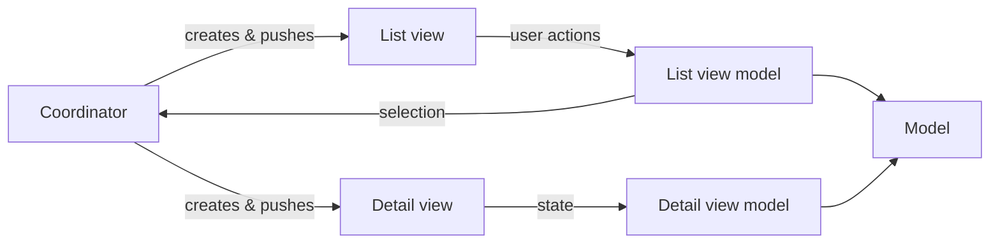

**MVVM-C.** Each screen is a *view* and a *view model*, as in MVVM — but
navigation is pulled out into a *coordinator*. A view model reports intent (a
selection); the coordinator, not the view model, decides which screen comes next
and pushes it. The views hold no navigation and the view models hold no UIKit,
so both can be tested on their own — see `Tests/`.

The example lives in `App/`: a list of items, and a detail screen the coordinator
shows when one is tapped. Add a screen by giving the coordinator a new route,
rather than pushing from inside a view.
