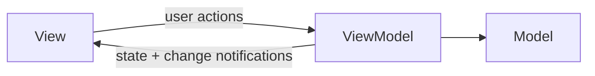

**MVVM.** The screen is split into a *view* and a *view model*. The view owns no
logic: it shows what the view model exposes and forwards user actions to it, then
re-renders when the view model reports a change. The view model holds the state
and the behaviour and has no reference to any UI framework, so it can be tested
without a running view — see `Tests/`.

The example lives in `App/`. As the app grows, keep each feature's view and view
model together and move shared types behind the view model, rather than adding a
layer before there is code that needs it.
