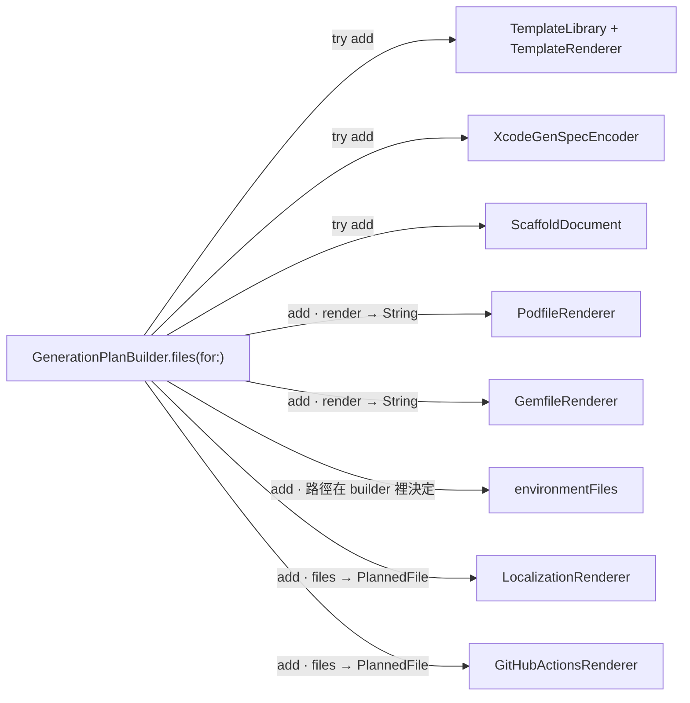
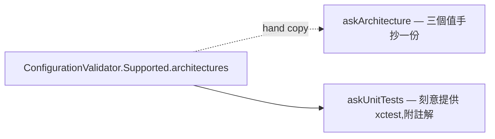

# 架構檢視:v0.9.0 → v1.0.0

日期:2026-07-27
基準:`main` @ f06ff78

範圍是走到 1.0 之前的 deepening opportunities。1.0 凍結三份契約(schema /
CLI / JSON),所以每一項都標了它是**凍結前才便宜**,還是**任何時候都一樣便宜**。

用語依 `CONTEXT.md`(領域)與 deep-module 詞彙(架構):module、interface、
implementation、depth、seam、adapter、leverage、locality。

## 結論

七項候選裡只有兩項受凍結約束:候選 4 與候選 5。其餘五項動的都是
implementation,而 `docs/contracts.md` 凍結的三份東西不含任何內部型別
——1.0 做與 1.3 做成本相同,因此**延後**,理由見最後一節。

---

## 1. 讓 encoder 沒有東西可以決定

**強度**:Strong ・ **期限**:任何時候都一樣便宜

```text
Sources/ScaffoldCore/XcodeGen/XcodeGenSpec.swift:8-10
Sources/ScaffoldCore/XcodeGen/XcodeGenSpecEncoder.swift:16, 51, 106-114,
                                                       166-184, 196, 210,
                                                       228, 259-269
```

**Problem**:`XcodeGenSpec` 宣稱「每個決定都住在這棵樹裡。把它變成 YAML 的
encoder 什麼都不發明」,但 encoder 至少在八處自行決定 spec 沒有建模的值:

| 決定 | 位置 |
|---|---|
| `sceneConfigurationName`,與模板裡的 `AppDelegate` 隱性約定 | `:16` |
| scene manifest 由一個 `Bool` 展開成三層結構 | `:172-184` |
| app → extension 的 `embed: true` 邊 | `:106-114` |
| `GENERATE_INFOPLIST_FILE` | `:196`, `:210` |
| `"bundle.unit-test"` / `"bundle.ui-testing"` / `"app-extension"` | `:190`, `:206`, `:228` |
| scheme 建哪些 target、測哪些 target | `:259-269` |
| `SWIFT_STRICT_CONCURRENCY = "complete"` | `:51` |

因為 spec 的形狀由 builder 決定,凡是 builder 沒預料到的,決定就落到
encoder ——這是四個 feature commit 每次都同時改兩個檔案的原因。

**Solution**:把那八個決定建模進 `XcodeGenSpec`,encoder 只留 Node 樹的順序
與引號規則(`:283-298`,它真正擁有的兩件事)。

**Wins**
- locality:決定收在一個 module
- encoder 的 interface 縮到序列化
- 新 feature 只動 builder
- 跨檔案的隱性約定變成欄位
- 測試分工:builder 測決定,encoder 測形狀

> 對齊 [ADR-0002](../adr/0002-build-project-yml-from-swift-types.md),不是推翻它
> ——目前的 encoder 是從那份決策漂走的一端。

---

## 2. 產生 PlannedFile 的東西,給它們一個共同 interface

**強度**:Strong ・ **期限**:任何時候都一樣便宜

```text
Sources/ScaffoldCore/Planning/GenerationPlanBuilder.swift:54-100, 258-298
Sources/ScaffoldCore/Planning/FileManifest.swift:70-74
Sources/ScaffoldCore/Generation/LocalizationRenderer.swift:5-9
Sources/ScaffoldCore/Generation/EnvironmentFilesRenderer.swift
```

**Problem**:`files(for:)` 是一段直線程式碼,八個來源、五種呼叫形狀,`origin`
是自由字串沒有任何檢查。其中 `EnvironmentFilesRenderer` 的路徑決定住在
builder 裡(`:266`, `:276`, `:283`),所以改一條 xcconfig 路徑會弄壞四個
測試檔,而它們沒有一個提到那個 renderer 的名字。



**Solution**:一個 interface(`origin` + `files(for:)`),builder 對一個陣列
迭代,路徑決定回到各自的 renderer。

**Wins**
- leverage:一個 interface,N 個 producer
- `origin` 由型別給,不再是字串
- `LocalizationRenderer` 與 `EnvironmentFilesRenderer` 拿到 test surface
- File Manifest 首次可直接測(今天測試裡沒有一處提到它的名字)
- 新 Features Layer 項目:加一筆,不是加一段

> 誠實範圍:新增一個 Features Layer 項目今天動 16–19 個檔案,這一項只收掉
> 生成端。schema、docs 與 freeze 表的那一半由候選 5 與既有的四道測試守著。

---

## 3. 命令層唯一的 seam 是一個 process

**強度**:Strong ・ **期限**:任何時候都一樣便宜

```text
Sources/xscaffold/Output/Reporter.swift:61-66, 90-130, 135-137
Sources/xscaffold/Commands/NewCommand.swift:161-193, 275-287
Sources/xscaffold/Commands/ProjectResolution.swift:171-176, 185-187
Tests/CommandLineTests/RunningTheBinary.swift
```

**Problem**:`Reporter` 直接 `print` / 寫 `FileHandle.standardError`,所以
`import xscaffold` 在 `Tests/` 底下出現 0 次——命令層的 interface 事實上
是「跑一個行程」。`Tests/CommandLineTests/` 的 94 個 `@Test` 全部靠 spawn。

更嚴重的是有一段**連 spawn 都到不了**:repo 沒有 PTY harness,所有 `new`
測試都用 `xscaffoldWithoutInput`(關掉 stdin),因此

- `NewCommand.run()` 的互動分支 `:161-193`
- `NewCommand.reportSaved` `:275-287`
- `confirmed` 真正發問的那條路 `ProjectResolution.swift:171-176`
- `cancelled` 的 text 分支 `:185-187`

**沒有任何測試執行過**。底下的邏輯在 core 側被 `PreviewSessionTests` 與
`InteractiveConfigurationTests` 蓋住了,但 `NewCommand` 把 prompter 接到
`PreviewSession` 的那段接線沒有。

**Solution**:`Reporter` 收一個 output sink——正式路徑寫 stdout/stderr,
測試路徑寫緩衝區。互動分支再配既有的 `ScriptedPrompter` 驅動,不需要 PTY。

**Wins**
- 兩個 adapter:真 seam,不是假設
- 互動分支第一次被測
- `ProjectResolution` 拿到 test surface
- 「警告走 stderr」可以直接斷言
- spawn 測試留給契約,不再兼差

> 不取代 spawn 測試。`Package.swift` 對它們的理由(exit code 與 stdout 只有
> 行程跑完才存在)仍然成立;這是**再加一個** seam。

---

## 4. 凍結字串,而不是凍結它們的數量

**強度**:Strong ・ **期限**:**凍結前才便宜** ・ **票**:#150

```text
Sources/ScaffoldSchema/ScaffoldError.swift:13-34   ScaffoldPhase,無明確 rawValue
Tests/ScaffoldCoreTests/JSONFreezeTests.swift:246-253, 257-263
Tests/ScaffoldSchemaTests/SkillReferenceTests.swift:62-80   已經有的正確做法
```

**Problem**:`ScaffoldPhase` 沒有宣告任何 rawValue,wire 上的字串就是 Swift
case 名——改名會安靜改掉 JSON,而 deprecation policy 明文把它列為 breaking
change。

| | 有字面斷言 |
|---|---|
| `ScaffoldPhase` | 4 / 10 |
| `ScaffoldErrorCode` | 4 / 25 |
| `ValidationCode`(`XS####`) | 32 / 32 |

守著其餘的只有 `allCases.count == 10` 與一條 regex。`phasesEncodeAsNames`
(`:257-263`)拿 `rawValue` 比對 `rawValue`——它證明編碼方式,不證明任何一個
字串。

**Solution**:給 `ScaffoldPhase` 明確 rawValue;phase 與 error code 兩組字串
照 `XS####` 的辦法釘在文件對照表上(`SkillReferenceTests` 對兩份 markdown
做雙向差集,改名兩邊都會紅)。

**Wins**
- 改名成為 test failure
- 凍結的是契約,不是計數
- 沿用已存在的機制,不發明新的
- 1.0 之後補不回來

---

## 5. 一個預設 nil 的欄位穿過 schema 凍結

**強度**:Strong ・ **期限**:**凍結前才便宜** ・ **票**:#151

```text
Tests/ScaffoldCoreTests/SchemaFreezeTests.swift:254-259, 264-278, 283-289
Tests/ScaffoldCoreTests/JSONFreezeTests.swift:143-148, 179-213   已經有的解藥
```

**Problem**:新增一個 Optional 且預設 nil 的欄位,三個斷言全過:

1. `goldensRoundTrip` — nil 不編碼,三份 golden 一個字都沒變
2. `goldensCoverTheSchema` — 兩邊都沒有它,兩個差集都空
3. `frozenSurfaceSize` — `83` 沒有變

欄位上線,契約不知道。同一類漂移已經發生過一次:
`ConfigurationValidator+ControlCharacters.swift:20-23` 記著
`cocoapodsVersion` 缺席已發佈的 JSON Schema 三個版本。

**Solution**:把 `JSONFreezeTests` 已經有的 `Mirror` 宣告檢查
(`declaredPropertiesAreFrozen`,理由寫在 `:143-148`)套到
`ProjectConfiguration` 那棵樹上。凍結面積由**型別**決定,不是由「這三份
golden 剛好寫了什麼」決定。

**Wins**
- 凍結面積由型別決定
- 已知漂移類型再現不了
- 一個檔案,一個 `@Test`
- 必須在 1.0 之前

---

## 6. prompt 抄了一條它保證不持有的規則

**強度**:Worth exploring ・ **期限**:任何時候都一樣便宜

```text
Sources/ScaffoldCore/Interactive/InteractiveConfiguration.swift:229-233  抄了
Sources/ScaffoldCore/Interactive/InteractiveConfiguration.swift:249-251  刻意不抄
Sources/ScaffoldCore/Validation/ConfigurationValidator+Capabilities.swift:18
Sources/ScaffoldCore/Interactive/PartialProjectConfiguration.swift:86-97
```

**Problem**:`askArchitecture` 把 `Supported.architectures` 手抄成三個字面
值。相隔二十行的 `askUnitTests` 為了**不**抄同一種東西,特地寫了註解說明
理由。同一個檔案,兩題套用相反的政策,而 `CONTEXT.md` 與
[ADR-0005](../adr/0005-interactive-new-command-separate-from-init.md)
都說 prompt 不內嵌相容性規則。



**Solution**:選項從 `ConfigurationValidator.Supported` 推導,顯示名沿用既有
的 `ArchitecturePattern+DisplayName`。

**Wins**
- 相容性規則回到一處
- 新 pattern 自動出現在 prompt
- `architecture.pattern` 的 32 處 fan-out 少一處

> 執行 ADR-0005,不是推翻它。附帶要一起看的:
> `PartialProjectConfiguration.swift:86-97` 把 `XS1201` 的前提寫進了答案型別,
> 註解明說那是為了繞開 re-ask 迴圈——那個繞道要不要留,是另一個題目。

---

## 7. ProjectResolution 是一堆函式,不是一個 module

**強度**:Worth exploring ・ **期限**:任何時候都一樣便宜(依賴候選 3)

```text
Sources/xscaffold/Commands/ProjectResolution.swift   292 行,12 個 entry point
Sources/xscaffold/Commands/GenerateCommand.swift:73-92
Sources/xscaffold/Commands/NewCommand.swift:140-152
Sources/xscaffold/Commands/PlanCommand.swift:37-46
```

**Problem**:十二個 module-scope 自由函式,做四件不同的事——錯誤轉譯、
一整個命令(`reportPlan :82-131`,檔案自己的註解寫「`plan` 的整份實作」)、
互動、成功回報。每個都吃 `Reporter`,都能同時 report 與 throw,所以
`generate.run()` 與 `new --yes` 各自把同一條管線抄了一遍,`destinationURL`
有三份。

**Solution**:收成一個 module,interface 是「跑哪幾步」,錯誤轉譯與回報退到
implementation 內。

**Wins**
- 六個命令共用一條管線
- `--yes` 不再是第二份實作
- 三份 `destinationURL` 變一份
- locality:新步驟只加一處

> 依賴候選 3:沒有 output sink,重排之後一樣只能靠 spawn 測,看不出對錯。

---

## 1.0 驗收缺口

不是 deepening,是 [#37](https://github.com/g761007/xcode-project-scaffold/issues/37)
那張驗收清單對得起來與對不起來的地方。

- **唯一一個從未被編譯過的官方模板**——
  `Templates/Shared/UITests/LaunchPerformanceTests.swift`。
  `launchPerformanceTest` 在 `Scripts/e2e.sh` 出現 0 次,`production` preset
  只開 `ui.enabled`。它被 lint job 讀過,沒有被 `xcodebuild` 讀過。roadmap
  §25 的 1.0 條件寫的是「所有官方模板可 Build、可 Test」。
- **一個即將凍結、卻沒有任何規則與任何問題的欄位**——`testing.ui` 沒有任何
  validator 讀它,`new` 也沒有任何一題問它(連 `--advanced` 都沒有)。抵達
  它的唯一途徑是手改 YAML 或 `--preset production`。
- **e2e 的 25 個專案沒有覆蓋的組合**——macOS × SPM、macOS × mixed、
  `preset: minimal`、`testing.unit: none`、第二個 `.lproj`。`--force` 與
  `--skip-git` 也不在 e2e 裡。
- **JSON 契約沒有一份對著真實 binary 的 golden**——
  `CommandOutputContractTests` 釘的是 in-process 建構出來的值;
  `CLIFreezeTests.stdoutCarriesOnlyTheDocument` 只檢查 9 個命令裡的 2 個能不能
  parse。一個命令若停止填 `destination`,整套測試會通過。
- **模板同步只有 CI 擋得住**——`Templates/` 與 `EmbeddedTemplates.swift` 的
  一致性靠 `ci.yml:30-33` 的 `git diff --exit-code`。本地 `make test` 偵測
  不到漂移,也沒有 pre-commit hook。
- **tag 上不跑 lint**——`release.yml` 的 `test` job 重跑 `swift test` 與
  `make e2e`,但沒有 `ci.yml` 那個 lint job,也就是「生成專案能通過它自己
  隨附的 linter」這項在發版路徑上不驗。

---

## 排序

**1.0 之前**

1. 候選 4(#150)— `ScaffoldPhase` 明確 rawValue ＋ 兩組字串釘上文件對照表
2. 候選 5(#151)— schema 凍結補上 `Mirror` 宣告檢查
3. e2e 補一個 `launchPerformanceTest: true` 的案例(尚未開票)

**1.0 之後**

候選 3 →(7)、1、2 各自獨立成版。

延後的理由不是來不及,是它們不受凍結約束:`docs/contracts.md` 凍結的是
schema、CLI 與 JSON,候選 1/2/3/6/7 動的都是 implementation,
`docs/contract-review.md:176-177` 甚至把生成專案自己的檔案也放在三份契約
之外。反過來,把四個內部重構塞進同一版有具體代價:候選 1 與 2 動的是全部
25 個 e2e 專案都會流過的生成路徑,而驗證它們的唯一手段是那個約 50 分鐘的
e2e job——若發版後生成結果不對,得同時排除「重構弄壞了」與「契約本來就寫
錯了」,而 1.0 的整個賣點就是後者不該再有疑問。

候選 3 有一個純品質的例外論點:`new` 的互動流程是 README 第一個範例,而它
沒有被任何測試執行過。若要在 1.0 前補,較便宜的做法是在
`Tests/CommandLineTests/` 加一個 PTY harness——純測試碼、零生產風險,也不擋
1.x 再做真正的 sink。
